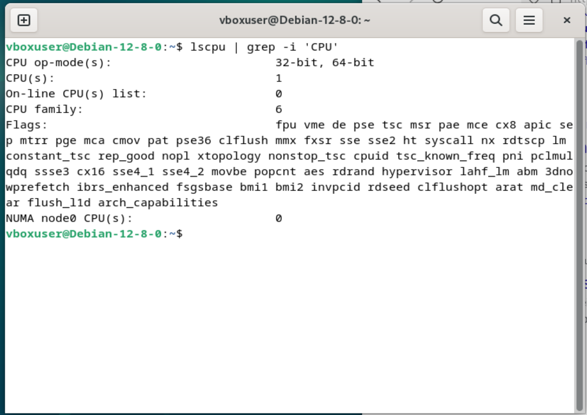

# KN01: Virtualisierung

## A) Hypervisor Typ 1 und 2 (30%)

Ein _Hypervisor_, auch bekannt als Virtual Machine Monitor (VMM), ist eine Software- oder Hardware-Ebene, die die Ausführung mehrerer virtueller Maschinen (VMs) auf einem physischen Host ermöglicht. Der Hypervisor stellt sicher, dass die VMs isoliert voneinander laufen und die Ressourcen des Hosts (wie CPU, Speicher und Netzwerk) effizient zugeteilt und verwaltet werden.

Es gibt zwei Haupttypen von Hypervisoren:

1. **Typ-1-Hypervisor** (auch _Bare-Metal-Hypervisor_ genannt): Dieser Hypervisor läuft direkt auf der Hardware des Hosts, ohne ein darunterliegendes Betriebssystem. Typ-1-Hypervisoren wie VMware ESXi, Microsoft Hyper-V und Xen sind bekannt für ihre hohe Effizienz und Performance, da sie direkten Zugriff auf die Hardware haben und speziell für den Betrieb von VMs optimiert sind. Sie werden häufig in Rechenzentren und produktiven Umgebungen verwendet.
    
2. **Typ-2-Hypervisor** (auch _Hosted Hypervisor_ genannt): Dieser Hypervisor läuft auf einem bestehenden Betriebssystem wie Windows, Linux oder macOS. Bekannte Beispiele sind VMware Workstation und Oracle VirtualBox. Typ-2-Hypervisoren sind leichter einzurichten und flexibler, aber in der Regel weniger performant, da sie auf die Hardware nur über das darunterliegende Betriebssystem zugreifen können.

## B) Virtualisierungssoftware (70%)

Da ich mit Oracle VM Virtualbox arbeite muss es sich um einen Typ-2-Hypervisor (Hosted Hypervisor) handeln. Sie greifen über das Host-OS auf die Hardware zu, sind dadurch weniger direkt mit ihr verbunden als Typ-1-Hypervisor

Ein Typ-2-Hypervisor kann nicht mehr Prozessoren oder RAM bereitstellen als das Host-OS zur Verfügung hat. Der Typ-2-Hypervisor verwaltet Ressourcen in Zusammenarbeit mit dem Host-Betriebssystem, das sicherstellt, dass keine Übernutzung der Hardware-Ressourcen stattfindet.

_Abbildung 1: Auswahl der VM Leistung in Virtualbox_

_Abbildung 2: Warnungen von Virtualbox_

_Abbildung 3: CPU Informationen in der erstellten Debian VM_

_Abbildung 4: Memory Informationen in der erstellten Debian VM_

**Bestätigung der Vermutung**: Die durchgeführten Schritte bestätigen die Vermutung, dass Oracle VM VirtualBox ein Typ-2-Hypervisor ist. Die Ressourcenbeschränkungen und die Abhängigkeit vom Host-Betriebssystem deuten darauf hin, dass VirtualBox auf die Hardware über das Betriebssystem zugreift, was für Typ-2-Hypervisoren typisch ist.
