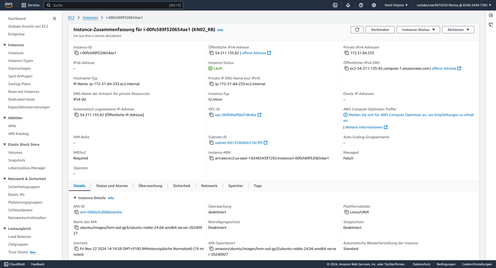
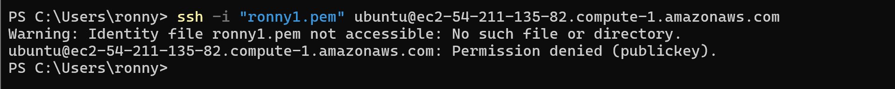
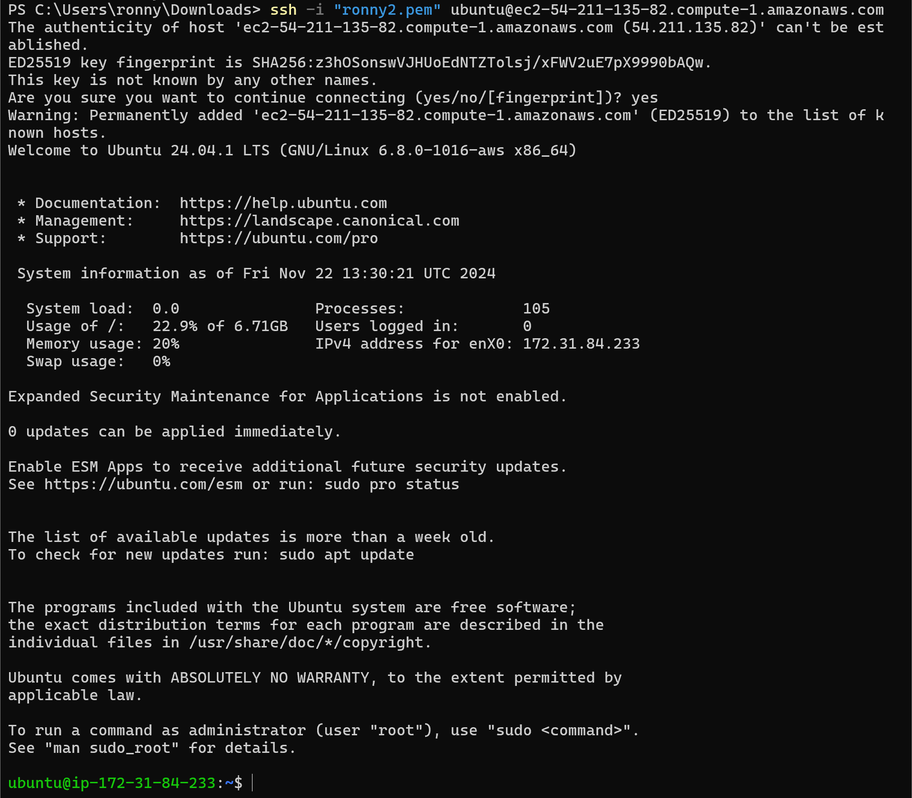

# KN02: IaaS - Virtuelle Server

## A) Umgang mit AWS Kurs (20%)

## B) Instanz erstellen (40%)

**Abgaben:**

- Screenshot der Liste der Instanzen und der Details Ihrer Instanz, die Sie hier erstellt haben. Die öffentliche IP muss sichtbar sein!

_Abbildung 1: Details der erstellten Instanz_

**Volumes:** 8 GiB gp3 (unverschlüsselt)
**OS:** Ubuntu 24.04
**RAM**: 1 GB
**Anzahl der CPUs**: 1 vCPU (virtueller CPU-Kern)

## C) Zugriff mit SSH-Key (40%)
**Abgaben**:

- Screenshot mit dem ssh-Befehl und des Resultats unter Verwendung des **ersten** Schlüssels

- Screenshot mit dem ssh-Befehl und des Resultats unter Verwendung des **zweiten** Schlüssels

- Screenshot der Instanz-Detail (oder Liste), so dass der verwendete Schlüssel sichtbar ist.

