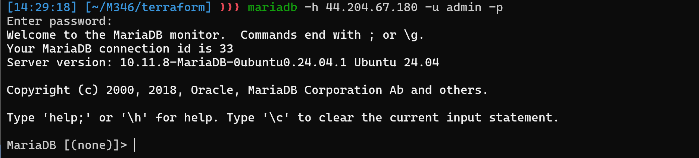
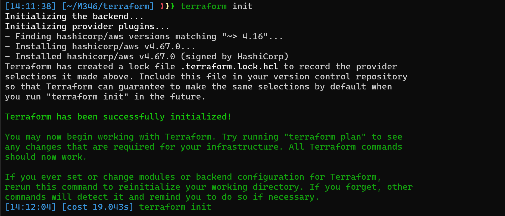
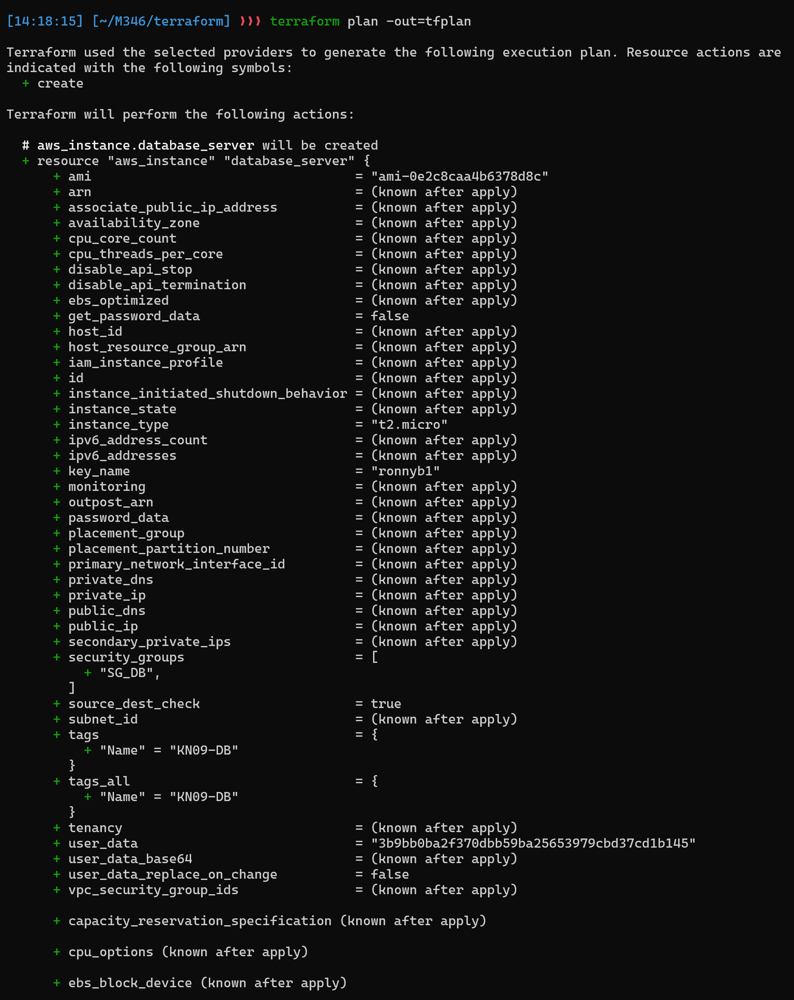
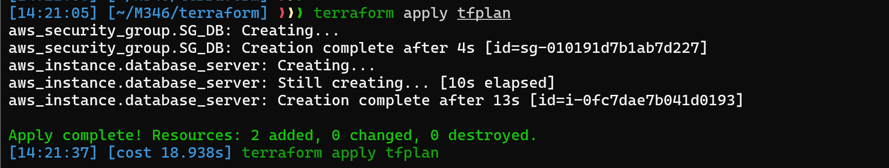

# KN09: Automation

## A) Automatisierung mit Command Line Interface (CLI) (30%)

**Abgaben:**

1. Screenshot der Details der Instanz, die Sie stoppen und starten

2. Befehle als Skript-Datei (oder die Befehle in Markdown).
3. Screenshot der Details der neu-erstellten Instanz. 
4. Screenshot des Befehls `telnet ihre-IP 3306`, um zu zeigen, dass das Cloud-Init auch tatsächlich ausgeführt wurde. 

## B) Terraform (70%)

**Abgaben**:

1. [Terraform Konfiguration](./main.tf)
[Terraform Variablen](./variables.tf)

2. Screenshot des Telnet-Befehls der zeigt, dass Ihr Datenbank-Zugriff auch tatsächlich funktioniert



3. Konsolen-Befehle, die Sie ausführen mussten (Terraform CLI).

```
terraform init
```

```
terraform plan -out=tfplan
```

```
terraform apply
```
4. Bei Aufgabe A haben Sie argumentiert was von Ihrer Seite her noch notwendig ist für die Automatisierung. Wieso ist das bei Terraform nicht notwendig?