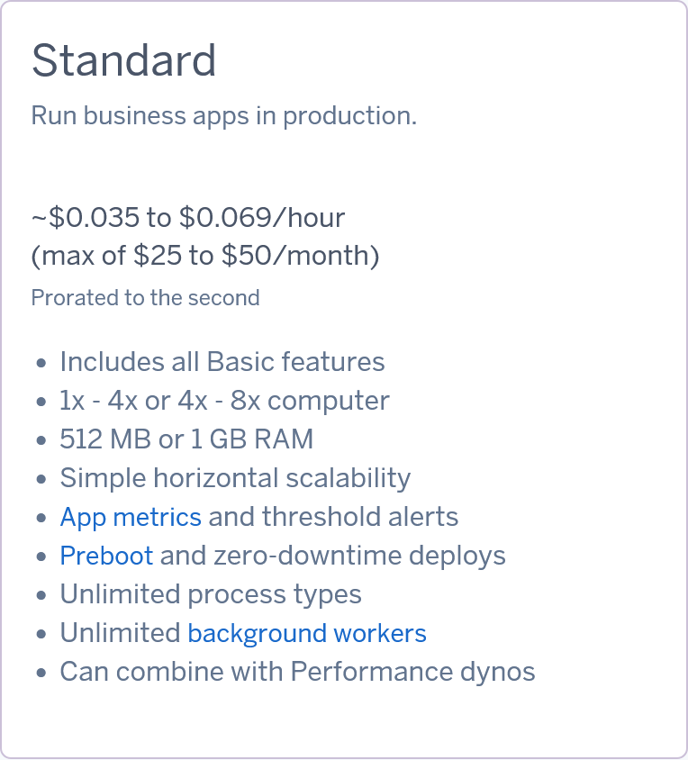
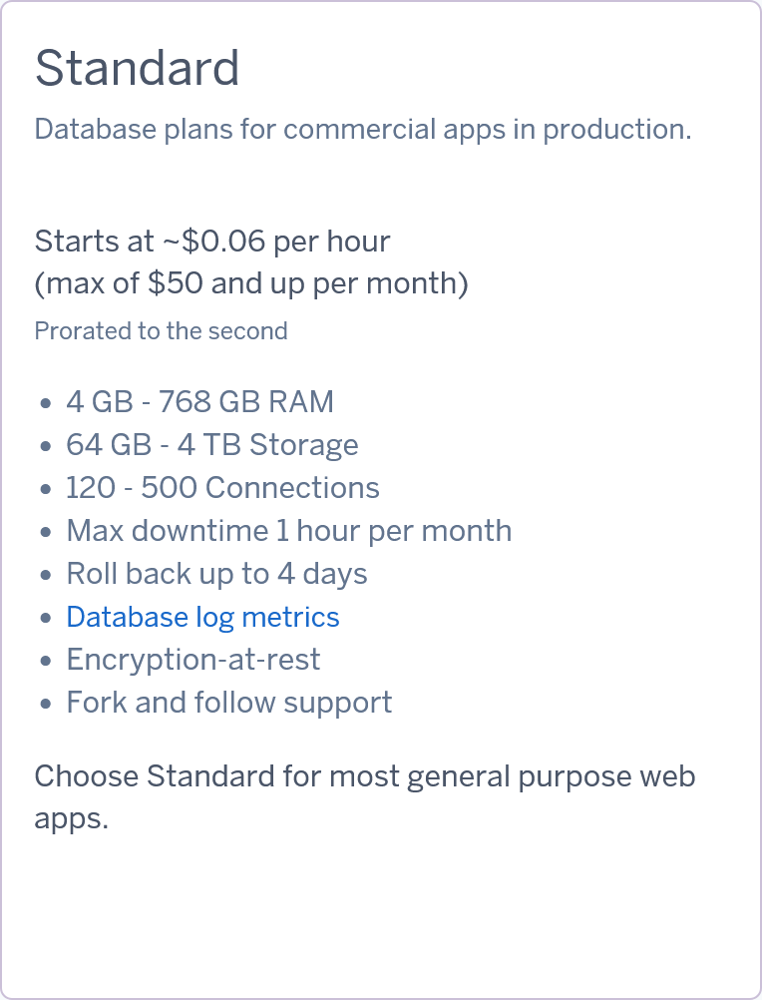
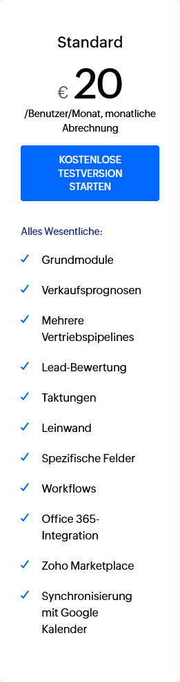
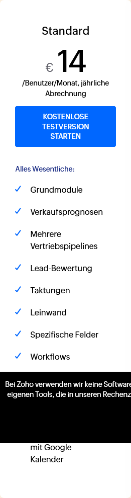
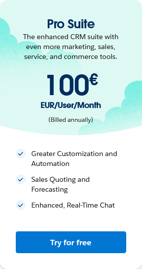

# KN10: Kostenberechnung

# Table of Contents
1. [KN10: Kostenberechnung](#kn10-kostenberechnung)
2. [On Premise Specs](#on-premise-specs)
3. [A) Kostenrechnung IAAS - Rehosting (60%)](#a-kostenrechnung-iaas---rehosting-60)
4. [Begründungen](#begründungen)
   1. [AWS](#aws)
   2. [Azure](#azure)
5. [B) Kostenrechnung PAAS - Replattforming (20%)](#b-kostenrechnung-paas---replattforming-20)
6. [C) Kostenrechnung SAAS - Repurchasing (10%)](#c-kostenrechnung-saas---repurchasing-10)
7. [D) Interpretation der Resultate (10%)](#d-interpretation-der-resultate-10)
8. [Fazit](#fazit)

---

## On Premise Specs
- 1 Web Server mit 1 Core, 20GB Speicher, 2 GB RAM, Ubuntu
- 1 DB Server mit 2 Cores, 100GB Speicher, 4 GB RAM, Ubuntu
- Backup-Speicher für die Datenbank Daten. Backups werden erstellt
  - täglich für die letzten 7 Tage
  - Wöchentlich für den letzten Monat
  - Monatlich für die letzten drei Monate.
- Anzahl Benutzer der Software: 30

# A) Kostenrechnung IAAS - Rehosting (60%)
### Quellen
- *[AWS Calculator](https://calculator.aws/#/)*

- *[Azure Calculator](https://azure.microsoft.com/en-us/pricing/calculator/)*. 

## Azure Specs

# Begründungen

Hier kurz ausgeführt die jeweiligen Vor- und Nachteile der gewählten Produkte sowie ihre Kosten.

## AWS
[AWS Calculation](/000%20TBZ/Module/346%20-%20Cloudlösungen%20konzipieren%20und%20realisieren/\Aufträge\AWS_Calculation.pdf)
**Monatliche Total Kosten 44.95 USD**
### Web Server
Der Web Server wird ein kleines Upgrade erhalten da die günstigste Version die *On Premise* Infrastruktur in Punkto CPU überflügelt, ansonsten werden die vorhandenen Spezifikationen übernommen.

**Monatliche Kosten 11.33 USD**
### DB Server
Der DB Server kann in AWS 1:1 abgebildet werden

**Monatliche Kosten 29.60 USD**
### Backup
Das Backup wurde mit 50 GB genutzten Daten berechnet und wir gehen von 2% Wachstum pro Jahr aus. 

**Monatliche Kosten 4.02 USD**

### Azure
[Azure Calculation](/000%20TBZ/Module/346%20-%20Cloudlösungen%20konzipieren%20und%20realisieren/\Aufträge\M346_Calculation_Azure_RB.pdf)

**Monatliche Total Kosten 125.60 USD**
#### Web Server
Mit Azure kann der Webserver bezüglich CPU und RAM übernommen werden, der Speicher wird allerdings mit 32 GB als kleinste verfügbare Einheit etwas grösser als bisher.

**Monatliche Kosten 34.61 USD**
#### DB Server
Das selbe gilt für den DB Server in Azure hier wird der verfügbare Speicher mit 128GB ebenfalls etwas grösser ausgelegt als bisher. Die restlichen Spezifikationen decken sich mit der *On Premise* Infrastruktur

**Monatliche Kosten 75.61 USD**
#### Backup
Da die Kalkulation des Backup in Azure nach der durchschnittlichen Speichergrösse der VMs berechnet wird, ist das Backup auf 128 GB ausgelegt.

**Monatliche Kosten 15.38 USD**

---
---
---

# B) Kostenrechnung PAAS - Replattforming (20%)
### Quellen
- [Heroku Pricing Liste](https://www.heroku.com/pricing) 
- [Dyno-Seite mit den Details](https://devcenter.heroku.com/articles/dyno-types)
## Heroku
Heroku bietet mit seinem PaaS eine einfach Möglichkeit Anwendungen und APIs bereitzustellen und zu skalieren. Spezielle Backuplösungen werden nicht speziell angeboten.
### Heroku Web

 Der Standard Dyno bietet ausreichend Leistung für unseren Web Server. Die Kosten berechnen sich je nach Nutzung. Gerechnet wird hier mit den angegebenen Maximalkosten pro Monat.

 **Monatliche Kosten 50.00 USD**
### Heroku DB

Das Standard Paket für Daten deckt ebenfalls die Anforderungen des bisherigen DB Servers. Die Maximalkosten werden hier kryptisch mit *maximal 50.00 USD und höher* angegeben. Wir schätzen dass bei unserer Nutzung bereits die "maximalen" 50 Dollar hoch angesetzt sind.

 **Monatliche Kosten 50.00 USD**
### Backup
Heroku bietet für seinen Standard-Tarif für DB einen rollback von bis zu vier Tagen an. 
Zusätzliche Backups sind Sache des Kunden.

---
---
---

# C) Kostenrechnung SAAS - Repurchasing (10%)

## Zoho
[Zoho Pricing](https://www.zoho.com/de/crm/zohocrm-pricing.html?source_from=crm-header)

### Monatliche Zahlung

_je nach Zahlungsinterval kostet das Standardangebot 420 oder 600 Euro im Monat_
**Monatliche Kosten 600 €**

### Jährliche Zahlung

_Zoho mit jährlicher Abrechnung_
Wenn der Tarif bei Zoho einmal jährlich gezahlt wird werden für 30 Mitarbeiter 420 € pro Monat fällig.

**Monatliche Kosten 420 €**

## SalesForce Sales Cloud
[SalesForce Sales Cloud](https://www.salesforce.com/eu/sales/pricing/)

Sales Force bietet mit der Pro Suite ein relativ teures Paket, welches wohl für unser Unternehmen am ehesten in frage kommt da die Starter Suite(750€/Monat) nur grundlegende Anforderungen an Account und Oppurtunity Manamegemt bietet. Die Pro Suite hingegen ist für mittlere Unternehmen, die erweiterte Anpassungen und Forecasting benötigen geeignet.
**Monatliche Kosten 3000 €**

**Abgabe:**

- Screenshots des Pricings **beider Anbieter** und Angabe welches ausgewählt wird.

- Erklärung **welches** Pricing Sie pro Anbieter verwenden würden und **wieso** genau dieses.
14
  
---
---
---

# D) Interpretation der Resultate (10%)

## Kostenvergleich

| Service                | Kosten pro Monat | Pro                                                                 | Contra                                                                |
|------------------------|------------------|---------------------------------------------------------------------|-----------------------------------------------------------------------|
| Zoho (monatlich)       | 600.00 USD       | - Flexibilität bei monatlicher Zahlung                              | - Höhere Kosten im Vergleich zur jährlichen Zahlung                   |
| Zoho (jährlich)        | 420.00 USD       | - Günstiger als monatliche Zahlung                                  | - Verpflichtung zur jährlichen Zahlung                                |
| SalesForce Sales Cloud | 3210.00 USD                 | - Leistungsstarke CRM-Funktionen                                    | - Höhere Kosten im Vergleich zu anderen Anbietern                     |
| AWS                    |  44.95 USD       | - Skalierbarkeit und umfangreiche Services                          | - Komplexität und mögliche versteckte Kosten                          |
| Azure                  | 125.60 USD       | - Integration mit Microsoft-Diensten                                | - Komplexität und mögliche versteckte Kosten                          |
| Heroku                 | 100.00 USD       | - Einfachheit und Benutzerfreundlichkeit                            | - Begrenzte Skalierbarkeit und höhere Kosten bei größerem Bedarf      |

## Vergleich

| **Kriterium**           | **On-Premise**                            | **IAAS (AWS/Azure)**                    | **PAAS (Heroku)**                      | **SAAS (Zoho/Salesforce)**            |
|-------------------------|-------------------------------------------|-----------------------------------------|----------------------------------------|---------------------------------------|
| **1. Infrastruktur und Betrieb** | - Hoher Aufwand für Aufbau, Wartung und Updates. - IT-Team notwendig für Ausfälle, Sicherheitsprobleme und Backups. | - Ein Teil des Betriebsaufwands wird an den Anbieter ausgelagert. - Weiterhin administrativer Aufwand für Instanzen und Backups. | - Reduzierter Aufwand durch automatische Skalierung, Updates und Grundsicherung. - Nur noch Implementierung und Konfiguration der Anwendung nötig. | - Minimaler Aufwand, da Anbieter alle Infrastruktur- und Wartungsaufgaben übernimmt. - Nur noch Konfiguration und Mitarbeiterschulung erforderlich. |
| **2. Kosten**           | - Hohe Anfangsinvestitionen für Hardware. - Laufende Kosten für Strom, Wartung, Ersatz und IT-Personal. | - Niedrigere laufende Kosten, aber nutzungsabhängig. - Technische Expertise erforderlich für Verwaltung und Betrieb. | - Fixe, aber höhere monatliche Kosten. - Inkludiert Infrastruktur- und Betriebskosten. | - Höchste laufende Kosten, da alle Betriebskosten und Mehrwertdienste enthalten sind. - Keine versteckten Zusatzkosten oder Überraschungen. |
| **3. Skalierbarkeit**   | - Begrenzte Skalierbarkeit. - Neue Hardware muss angeschafft und implementiert werden. | - Flexible Skalierung, abhängig von der Verwaltung durch die IT-Abteilung. | - Sehr flexible Skalierung, jedoch abhängig von der Implementierung. | - Sehr einfache Skalierbarkeit. - Keine weiteren Implementierungsschritte nötig bei Wachstum. |
| **4. Benutzerfreundlichkeit** | - Hoher technischer Aufwand erforderlich. - Schwieriger für Endanwender, IT-Kenntnisse nötig. | - Technisches Know-how erforderlich. - Schwieriger für Endanwender, trotzdem mehr Flexibilität. | - Benutzerfreundlich, jedoch weiterhin technisches Know-how nötig für die Konfiguration. | - Optimal für Endanwender. - Intuitive Benutzeroberflächen, sofort einsetzbar. |

# Fazit

**Empfohlene Option: Rehosting mit AWS**

Für unser KMU mit IT-Fokus und begrenztem Budget ist Rehosting auf AWS die beste Wahl:

- Kostenkontrolle: Die monatlichen Kosten sind deutlich geringer als bei den anderen Modellen.
- Geringer Aufwand: Bestehende Infrastruktur kann mit minimalem Anpassungsaufwand migriert werden.
- Langfristige Skalierbarkeit: AWS ermöglicht später eine Optimierung auf PaaS oder SaaS, falls nötig.

**Alternative: Replatforming mit Heroku**

Wenn die Firma bereit ist, die Applikation leicht anzupassen, bietet Replatforming mit Heroku Vorteile durch geringeren IT-Wartungsaufwand. Die Kosten sind höher, aber vertretbar.

**Nicht empfehlen würde ich Repurchasing**, aufgrund der hohen Kosten und des Verlusts von Kontrolle, was dieses Modell weniger attraktiv macht.

[top](#kn10-kostenberechnung)